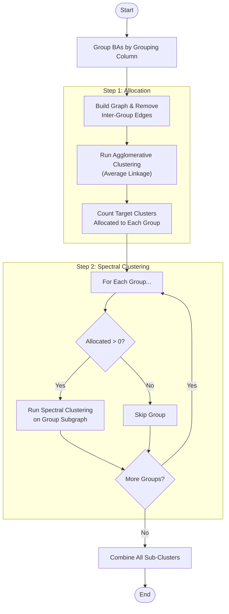
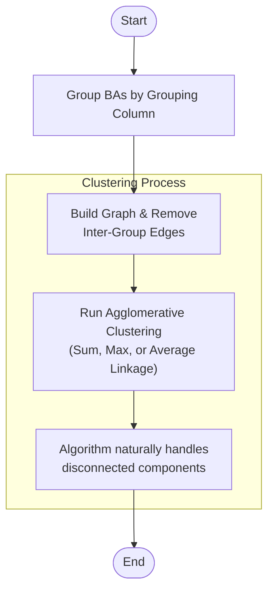

# Clustering Algorithms

The PowerGenome Settings Builder uses several clustering algorithms in **Step 1 (Regions)** to aggregate Balancing Authorities (BAs) into model regions. The goal is to reduce the computational complexity of transmission modeling while preserving the most critical transmission constraints.

For context on how these algorithms fit into the overall workflow, see the [Web Application documentation](web_app.md).

## Core Concepts

1. **Graph Construction**: A network graph is built where nodes are BAs and edges are weighted by the **firm transmission capacity** (MW) between them.
2. **Grouping Constraints**: Clustering respects the boundaries of the selected Grouping Column (e.g., NERC Region, State). BAs in different groups are generally not merged unless the algorithm is specifically configured to merge entire groups.

## Algorithms

### Spectral Clustering

**Spectral Clustering** is the default method. It uses the eigenvalues of the graph's Laplacian matrix to perform dimensionality reduction before clustering with K-Means.

* **Why it's used**: This method often produces balanced regions by finding "cuts" that minimize the ratio of cut weight to cluster volume.
* **Workflow**: When `Target Regions >= Number of Groups`, the algorithm uses a "Split-Apply-Combine" strategy to ensure disconnected groups are not mixed.

### Louvain Community Detection

**Louvain Community Detection** maximizes the **modularity** of the network.

* **Auto-optimize**: Can be used to find the "natural" number of regions where modularity is maximized.
* **Fixed Target**: Can be constrained to a fixed target number of regions (though less naturally than other methods).

### Hierarchical Clustering

**Hierarchical Clustering** builds a hierarchy of clusters. The tool supports three linkage criteria:

1. **Sum Linkage**: Merges clusters based on the **total** weight of edges between them. Tends to create a few very large central clusters ("snowballing").
2. **Average Linkage**: Merges based on the **average** weight of edges (Total Weight / (Size A * Size B)). This penalizes merging large clusters, leading to more even cluster sizes.
3. **Max Linkage**: Merges based on the **maximum** single edge weight between clusters (Single Linkage).

**Workflow**: When selected (and `Target Regions >= Number of Groups`), the algorithm runs on the full graph but respects group boundaries by removing edges between groups.

## ESR-Compatible Clustering

When the **ESR-compatible clustering** option is enabled in Step 1, an additional constraint is applied to all clustering algorithms to ensure that Balancing Authorities whose states cannot trade Energy Share Requirement (ESR) credits (i.e., credits for RPS/CES policies) are never placed in the same model region.

### How It Works

ESR-compatible clustering modifies the graph construction phase:

1. **State Trading Rules**: The algorithm uses data [from ReEDS](https://nrel.github.io/ReEDS-2.0/model_documentation.html#state-renewable-portfolio-standards) that defines state trading compatibility. This data is based historical observations from a [2016 report](https://www.cesa.org/wp-content/uploads/Potential-RPS-Markets-Report-Holt.pdf). It does not account for the difference betwen bundled and unbundled RECs or limits on how much of a states requirement can be imported.
**Transitive Trading**: States are considered compatible if they can trade transitively (e.g., if State A trades with State C, and State B trades with State C, then A and B are compatible).
2. **Graph Modification**: Edges are removed between BAs whose states cannot trade, even if they have transmission capacity.
3. **Group Pre-splitting**: Before clustering, grouping column groups (e.g., NERC regions) are split into trading subgroups. BAs within non-compatible states are placed in separate subgroups even if they share the same grouping value.

### Impact on All Algorithms

ESR-compatible clustering affects all algorithms uniformly:

* **Spectral Clustering**: Operates on the modified graph with trading-incompatible edges removed. Each trading subgroup is clustered independently.
* **Louvain Community Detection**: Works with the constrained graph where only trading-compatible BAs can be in the same community.
* **Hierarchical Clustering**: Merges only occur between BAs whose states can trade transitively.

### Workflow Example

### Key Differences from Standard Clustering

| Aspect | Standard Clustering | ESR-Compatible Clustering |
| ------ | ------------------- | ------------------------- |
| **Edge Criteria** | Transmission capacity only | Transmission capacity AND state trading rules |
| **Grouping** | By selected column (e.g., NERC) | By selected column THEN by trading zones |
| **Result Count** | May meet target exactly | May exceed target if trading rules require more regions |
| **Region Names** | Based on geography/hierarchy | Same naming convention |

### When to Use

* **Enable ESR-compatible clustering** when modeling state-level clean energy policies (RPS, CES) and you want model regions that naturally align with policy trading zones.
* **Leave disabled** when transmission connectivity is the primary concern, or when you're not modeling state energy policies. The ESR step (Step 6) will automatically handle any incompatibilities by creating sub-regions for policy tracking if needed.

!!! note
    ESR-compatible clustering may produce more regions than your target if state trading boundaries require additional separation. This is expected behavior—the algorithm prioritizes policy compliance over hitting the exact target number.
