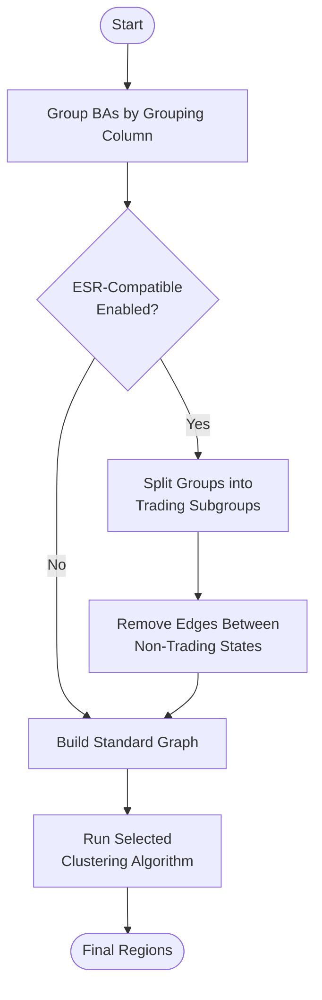
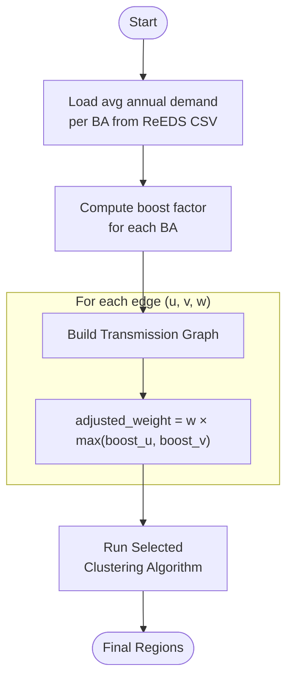

# Clustering Algorithms

PowerGenome System Design uses several clustering algorithms in **Step 1 (Regions)** to aggregate Balancing Authorities (BAs) into model regions. The goal is to reduce the computational complexity of transmission modeling while preserving the most critical transmission constraints.

For context on how these algorithms fit into the overall workflow, see the [Web Application documentation](web_app.md).

## Core Concepts

1. **Graph Construction**: A network graph is built where nodes are BAs and edges are weighted by the **firm transmission capacity** (MW) between them.
2. **Grouping Constraints**: Clustering respects the boundaries of the selected Grouping Column (e.g., NERC Region, State). BAs in different groups are generally not merged unless the algorithm is specifically configured to merge entire groups.

## Algorithms

### Spectral Clustering

**Spectral Clustering** is the default method. It uses the eigenvalues of the graph's Laplacian matrix to perform dimensionality reduction before clustering with K-Means.

* **Why it's used**: This method often produces balanced regions by finding "cuts" that minimize the ratio of cut weight to cluster volume.
* **Workflow**: When `Target Regions >= Number of Groups`, the algorithm uses a "Split-Apply-Combine" strategy to ensure disconnected groups are not mixed.

#### Handling Disconnected BAs Within a Group

After cross-group edges are removed, some BAs inside the same group may be mutually unreachable — for example, when a BA has no direct transmission record to its neighbours in the dataset. Without intervention these isolated BAs would become forced singleton regions regardless of the target count.

To prevent this, the algorithm inserts **synthetic weak edges** to connect any disconnected components that share the same grouping value:

* The synthetic edge weight is based on the smallest real edge weight within that same grouping group.
* One synthetic edge is added per pair of adjacent disconnected components (chain linkage), so the number of additions is minimal.
* These links are intentionally weak — they serve only to make the group traversable and should not meaningfully influence which BAs ultimately merge together.


### Louvain Community Detection

**Louvain Community Detection** maximizes the **modularity** of the network.

* **Auto-optimize**: Can be used to find the "natural" number of regions where modularity is maximized.
* **Fixed Target**: Can be constrained to a fixed target number of regions (though less naturally than other methods).

### Hierarchical Clustering

**Hierarchical Clustering** builds a hierarchy of clusters. The tool supports three linkage criteria:

1. **Sum Linkage**: Merges clusters based on the **total** weight of edges between them. Tends to create a few very large central clusters ("snowballing").
2. **Average Linkage**: Merges based on the **average** weight of edges (Total Weight / (Size A * Size B)). This penalizes merging large clusters, leading to more even cluster sizes.
3. **Max Linkage**: Merges based on the **maximum** single edge weight between clusters (Single Linkage).

**Workflow**: When selected (and `Target Regions >= Number of Groups`), the algorithm runs on the full graph but respects group boundaries by removing edges between groups. Synthetic weak edges are inserted to reconnect any disconnected components within a group (see [Handling Disconnected BAs Within a Group](#handling-disconnected-bas-within-a-group)).


## ESR-Compatible Clustering

When the **ESR-compatible clustering** option is enabled in Step 1, an additional constraint is applied to all clustering algorithms to ensure that Balancing Authorities whose states cannot trade Energy Share Requirement (ESR) credits (i.e., credits for RPS/CES policies) are never placed in the same model region.

### How It Works

ESR-compatible clustering modifies the graph construction phase:

1. **State Trading Rules**: The algorithm uses data [from ReEDS](https://nrel.github.io/ReEDS-2.0/model_documentation.html#state-renewable-portfolio-standards) that defines state trading compatibility. This data is based historical observations from a [2016 report](https://www.cesa.org/wp-content/uploads/Potential-RPS-Markets-Report-Holt.pdf). It does not account for the difference betwen bundled and unbundled RECs or limits on how much of a states requirement can be imported.
**Transitive Trading**: States are considered compatible if they can trade transitively (e.g., if State A trades with State C, and State B trades with State C, then A and B are compatible).
2. **Graph Modification**: Edges are removed between BAs whose states cannot trade, even if they have transmission capacity.
3. **Group Pre-splitting**: Before clustering, grouping column groups (e.g., NERC regions) are split into trading subgroups. BAs within non-compatible states are placed in separate subgroups even if they share the same grouping value.

### Impact on All Algorithms

ESR-compatible clustering affects all algorithms uniformly:

* **Spectral Clustering**: Operates on the modified graph with trading-incompatible edges removed. Each trading subgroup is clustered independently.
* **Louvain Community Detection**: Works with the constrained graph where only trading-compatible BAs can be in the same community.
* **Hierarchical Clustering**: Merges only occur between BAs whose states can trade transitively.

### Workflow Example



### Key Differences from Standard Clustering

| Aspect | Standard Clustering | ESR-Compatible Clustering |
| ------ | ------------------- | ------------------------- |
| **Edge Criteria** | Transmission capacity only | Transmission capacity AND state trading rules |
| **Grouping** | By selected column (e.g., NERC) | By selected column THEN by trading zones |
| **Result Count** | May meet target exactly | May exceed target if trading rules require more regions |
| **Region Names** | Based on geography/hierarchy | Same naming convention |

### When to Use

* **Enable ESR-compatible clustering** when modeling state-level clean energy policies (RPS, CES) and you want model regions that naturally align with policy trading zones.
* **Leave disabled** when transmission connectivity is the primary concern, or when you're not modeling state energy policies. The ESR step (Step 6) will automatically handle any incompatibilities by creating sub-regions for policy tracking if needed.

!!! note
    ESR-compatible clustering may produce more regions than your target if state trading boundaries require additional separation. This is expected behavior—the algorithm prioritizes policy compliance over hitting the exact target number.

## Demand-Based Edge Weighting

When clustering BAs into model regions, BAs that have both **small annual demand** and **weak transmission connections** can end up as isolated single-BA regions. These tiny regions waste model variables without adding useful fidelity.

Demand-based edge weighting addresses this by inflating the edge weights of low-demand BAs in the transmission graph before clustering runs. A heavier edge makes a BA look more strongly connected to its neighbours, so the clustering algorithm is more likely to merge it rather than leave it alone.

### Data Source

Boost factors are derived from `data/reeds_annual_demand_2050.csv`, which contains ReEDS 2050 projected annual demand (MWh) by BA and weather year. The per-BA value used is the **average demand across all weather years** in that file.

### Boost Factor Calculation

A scalar *boost factor* ≥ 1.0 is computed for every BA. When an edge connects BA *u* and BA *v* with raw transmission capacity *w*, the adjusted weight used by the clustering algorithm is:

```
adjusted_weight = w × max(boost_u, boost_v)
```

Using the **maximum** of the two endpoints means that if *either* BA has low demand, the shared edge is strengthened. BAs at or above the reference demand level receive a boost of exactly 1.0 — their edges are never suppressed.

#### Sqrt Inverse Demand (mild)

```
boost = max(1.0, sqrt(median_demand / demand))
```

| Demand relative to median | Boost factor |
|--------------------------|-------------|
| 4× above median | 1.0 (clamped) |
| At median (1×) | 1.0 |
| ¼ of median | 2.0× |
| 1/16 of median | 4.0× |

The square-root relationship produces a gentle, graduated boost. Most BAs are affected only mildly, and only extreme outliers receive a large adjustment.

#### Log Inverse Demand (aggressive)

```
boost = max(1.0, log(max_demand + 1) / log(demand + 1))
```

This method anchors the boost to the highest-demand BA in the dataset. The logarithm compresses large values and expands small ones, so very-low-demand BAs receive a disproportionately large boost. Use this when sqrt weighting still leaves small BAs isolated.

### Interaction with Clustering Algorithms

Demand weighting only modifies edge weights during graph construction in `build_transmission_graph()`. The clustering algorithm itself (Spectral, Hierarchical, or Louvain) runs unchanged on the adjusted graph.



### Using Demand Weighting in the UI

The **Demand Weighting** dropdown appears in the **Clustering** settings panel (Step 1), directly below the **Clustering Method** dropdown. It is hidden when Auto-optimize mode is enabled.

| Option | Method | When to use |
|--------|--------|-------------|
| None (transmission only) | No boost applied | Default; use when small isolated regions are acceptable |
| Sqrt inverse demand (mild) | `demand-sqrt` | First choice when a few BAs form unwanted tiny regions |
| Log inverse demand (aggressive) | `demand-log` | When sqrt weighting is insufficient for very-small-demand BAs |

!!! tip
    Start with **Sqrt inverse demand** and inspect the resulting map. If very small BAs are still appearing as singleton regions, switch to **Log inverse demand**. The tradeoff is that aggressive weighting can pull small BAs into geographically distant neighbours if the direct transmission path is weak.
