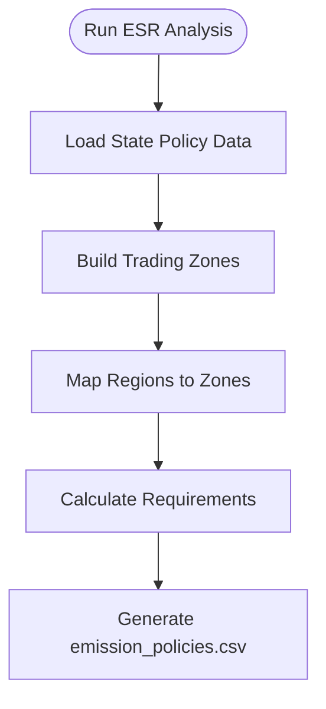
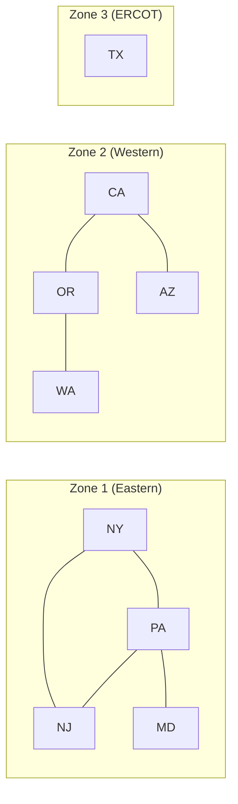

# ESR Policies

Energy Share Requirements (ESR) are policy constraints that require a fraction of electricity demand to be met by qualifying resources. PowerGenome System Design supports two types of ESR policies:

* **Renewable Portfolio Standards (RPS)**: Require a percentage of electricity to come from renewable sources
* **Clean Energy Standards (CES)**: Require a percentage from clean energy sources (renewables plus other zero-carbon technologies like nuclear)

The ESR step (Step 6) generates the `emission_policies.csv` file that PowerGenome uses to apply these constraints to your model.

## Overview

When you run ESR analysis, the app:

1. **Builds trading zones** by grouping states that can trade credits with each other
2. **Maps model regions** to their participating zones (a region may be in multiple zones)
3. **Calculates policy requirements** as population-weighted averages of state policies
4. **Identifies qualifying technologies** that can satisfy each policy type



## ESR Trading Rules

Not all states allow trading of renewable energy credits (RECs) or clean energy credits. The app uses trading rules to determine which states can participate in the same ESR zone.

### Data Source

Trading relationships are defined in `web/data/state_policies/rectable.csv`, a matrix where:

* Rows and columns are state abbreviations (uppercase)
* A value of `1` means the two states can trade
* A value of `0` or blank means they cannot

This data comes from [ReEDS model documentation](https://nrel.github.io/ReEDS-2.0/model_documentation.html#state-renewable-portfolio-standards), which is based on historical observations from a [2016 CESA report](https://www.cesa.org/wp-content/uploads/Potential-RPS-Markets-Report-Holt.pdf).

### How Trading is Determined

The app uses a simple lookup to check if two states can trade:

1. Convert state codes to uppercase
2. Look up the value in the rectable matrix at `[state1, state2]`
3. If the value exists and is greater than 0, the states can trade

!!! warning "Limitations"
    The trading rules data does not account for:

    * Differences between bundled and unbundled RECs
    * Limits on how much of a state's requirement can be imported
    * Recent policy changes (data is from 2016)

## ESR Zone Creation

States are grouped into **ESR zones** where all states in a zone can trade with each other, either directly or through intermediate trading partners.

### Step 1: Collect States from Model Regions

The app first identifies all states present in your clustered model regions by looking up each BA's state in the hierarchy data.

### Step 2: Limit by Interconnect

**Trading is limited to within the same interconnect.** The three interconnects are:

* **Eastern Interconnection**
* **Western Interconnection (WECC)**
* **ERCOT (Texas)**

This reflects the physical reality that RECs typically cannot flow across interconnect boundaries. The app determines each state's primary interconnect by counting how many BAs that state has in each interconnect and choosing the one with the most.

### Step 3: Build Trading Graph

For states within the same interconnect, the app builds a graph where:

* Nodes are states
* Edges connect states that can directly trade (per `rectable.csv`)

### Step 4: Find Connected Components

The app uses depth-first search (DFS) to find **connected components** in the trading graph. Each connected component becomes an ESR zone.



### Transitive Trading

States don't need a direct trading relationship to be in the same zone. If:

* State A can trade with State C
* State B can trade with State C

Then A, B, and C are all in the same zone, even if A and B cannot trade directly. This **transitive** approach reflects that credits can flow through intermediate states.

## Multi-State and Multi-Zone Regions

### Regions Spanning Multiple States

When a model region contains BAs from multiple states, the ESR requirement for that region is the **population-weighted average** of each state's policy requirement.

For example, if a region has:

* 60% of population in State A (30% RPS requirement)
* 40% of population in State B (20% RPS requirement)

The region's RPS requirement = 0.6 × 30% + 0.4 × 20% = **26%**

Population data comes from `web/data/state_policies/state-pop-fraction.csv`.

### Regions Spanning Multiple Zones

If a model region contains states from **different trading zones**, that region will have values in **multiple ESR columns**. Each column represents the weighted contribution from states in that zone.

For example, if `MidWest` region has:

* 70% population in Zone 1 states (average 25% RPS)
* 30% population in Zone 2 states (average 15% RPS)

Then `MidWest` would have:

* `ESR_1` (Zone 1 RPS) = 0.70 × 25% = 17.5%
* `ESR_3` (Zone 2 RPS) = 0.30 × 15% = 4.5%

!!! tip
    To avoid regions spanning multiple zones, enable **ESR-compatible clustering** in Step 1. This ensures BAs are only clustered together if their states can trade.

## Output Format

### emission_policies.csv Structure

The generated CSV contains:

| Column | Description |
| ------ | ----------- |
| `case_id` | Case identifier (default: "all") |
| `year` | Model year |
| `region` | Model region name |
| `ESR_1`, `ESR_2`, ... | ESR constraint fractions by zone |

Each trading zone generates two ESR columns:

* Odd-numbered columns (ESR_1, ESR_3, ...) are for **RPS**
* Even-numbered columns (ESR_2, ESR_4, ...) are for **CES**

### Example Output

```csv
case_id,year,region,ESR_1,ESR_2,ESR_3,ESR_4
all,2030,NewEngland,0.35,0.40,0.0,0.0
all,2030,MidAtlantic,0.25,0.30,0.0,0.0
all,2030,ERCOT,0.0,0.0,0.15,0.20
all,2040,NewEngland,0.50,0.60,0.0,0.0
...
```

In this example:

* ESR_1 and ESR_2 are for the Eastern zone (RPS and CES respectively)
* ESR_3 and ESR_4 are for the ERCOT zone
* NewEngland and MidAtlantic are in the Eastern zone
* ERCOT is in its own zone

## Technology Qualification

The app determines which technologies can satisfy RPS and CES requirements using `web/data/state_policies/allowed_techs.csv`.

### Qualification Rules

Technologies are matched using keyword matching against the `RPS` and `CES` columns:

* If a technology name contains any keyword in the `RPS` column, it qualifies for RPS
* If a technology name contains any keyword in the `CES` column, it qualifies for CES
* For new-build resources, ESR-facing technology labels use the base technology name, and `tech_detail` is used for matching only rather than becoming part of the ESR key

### CES ≥ RPS Rule

CES requirements are automatically floored to at least match RPS requirements for each zone. This reflects that all RPS-qualifying resources (renewables) also qualify for CES, so the CES requirement can never be lower than RPS.

## Key Assumptions

The ESR generation makes several important assumptions:

### 1. Interconnect Boundaries

Trading is **completely limited** to within the same interconnect. States cannot trade RECs or clean energy credits across the Eastern-Western or Eastern-ERCOT boundaries.

### 2. Population as Demand Proxy

When weighting multi-state regions, population is used as a proxy for electricity demand. This is a simplification—actual demand patterns may differ.

### 3. Static Trading Rules

Trading relationships are based on historical data (2016) and don't account for policy changes since then.

### 4. No Trading Limits

The model assumes unlimited credit trading within a zone. Real policies may have caps on imported credits.

### 5. Uniform Technology Qualification

Technology qualification is applied uniformly across all states. In reality, some states may have technology-specific carve-outs or restrictions.

## Data Files Reference

| File | Purpose |
| ---- | ------- |
| `web/data/state_policies/rectable.csv` | State-to-state trading relationships |
| `web/data/state_policies/rps_fraction.csv` | RPS requirements by state and year |
| `web/data/state_policies/ces_fraction.csv` | CES requirements by state and year |
| `web/data/state_policies/state-pop-fraction.csv` | Population fractions by BA and state |
| `web/data/state_policies/allowed_techs.csv` | Technology qualification keywords |
| `web/data/hierarchy.csv` | BA hierarchy (includes state and interconnect) |

## Related Documentation

* [Web Application](web_app.md) - Full workflow guide including ESR step
* [Algorithms](algorithms.md) - ESR-compatible clustering details
